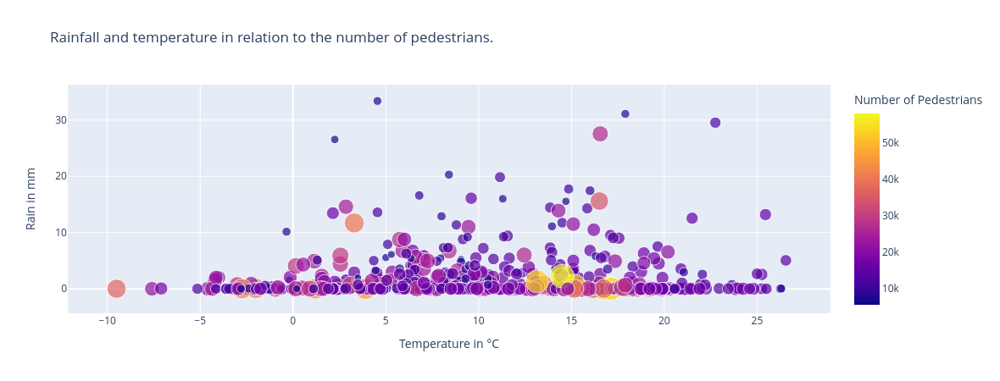
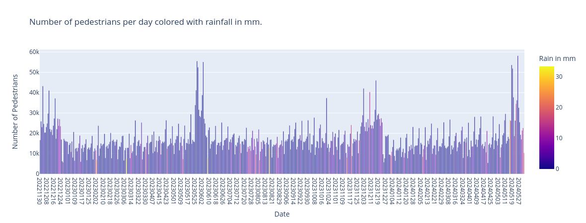
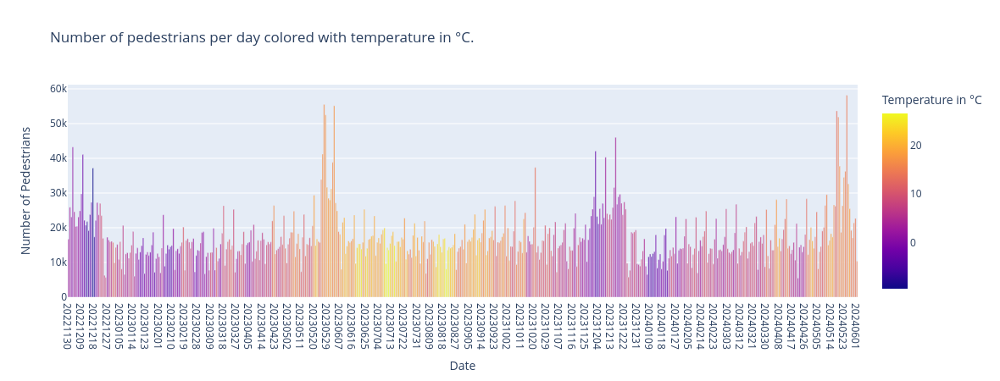

# Data Report

## Question
<!-- Your question for your whole project -->
Do temperature and rainfall negatively correlate with the number of people walking through the pedestrian zone in Erlangen?

## Data Sources
<!-- Describe your data sources: Why you have chosen them, where they are from, and what data they contain -->
This analysis uses historical weather data, including temperature and rainfall measurements, along with pedestrian traffic data from yesterday to 550 days in the past. The data is collected, filtered, and prepared through Python and Jayvee pipelines before being displayed in graphs and analyzed. Since there is no public weather data source directly in Erlangen, an average between the two surrounding locations 'Möhrendorf-Kleinseebach' and 'Nürnberg Airport' is calculated to determine the weather in Erlangen.

### Datasource 1: [opendata.dwd.de](https://opendata.dwd.de)

#### Structure and Quality
<!-- What is the data structure and quality of your sources? (Compare lecture D01) -->

The data from the "Deutscher Wetterdienst" is retrieved as a ZIP file. The text file containing the data is structured like a CSV file with ";" as separator. Unfortunately, it is filled with spaces to align the content and facilitate human readability. For the automatic data pipeline this was an obstacle that had to be handled.

##### Data Structure (rain dataset)

- STATIONS_ID: Station ID.
- MESS_DATUM: Date of measurement.
- QN_6: Quality level.
- RS: Rainfall amount (mm).
- RSF: Rainfall form (type).
- SH_TAG: Snow height (cm).
- NSH_TAG: New snow height (cm).
- eor: End of record indicator.

##### Data Quality (rain dataset)

- Accuracy: High, given the structured format and clear measurement units.
- Completeness: Full dataset with no missing values in sample.
- Consistency: Consistent data points across records.
- Timeliness: Regular daily measurements.
- Relevancy: Relevant for weather analysis and trend tracking.

##### Data Structure (temperature dataset)

- ONS_ID: Observation station ID.
- MESS_DATUM: Date of measurement.
- QN_3: Quality level 3.
- FX: Maximum wind speed (m/s).
- FM: Mean wind speed (m/s).
- QN_4: Quality level 4.
- RSK: Rainfall amount (mm).
- RSKF: Rainfall form (type).
- SDK: Sunshine duration (hours).
- SHK_TAG: Snow height (cm).
- NM: Cloud cover (1/8).
- VPM: Vapor pressure (hPa).
- PM: Air pressure (hPa).
- TMK: Mean temperature (°C).
- UPM: Relative humidity (%).
- TXK: Maximum temperature (°C).
- TNK: Minimum temperature (°C).
- TGK: Ground minimum temperature (°C).
- eor: End of record indicator.

##### Data Quality (temperature dataset)

- Accuracy: Detailed and precise with multiple weather parameters.
- Completeness: Comprehensive dataset with no apparent missing values.
- Consistency: Uniform data collection standards.
- Timeliness: Daily observations ensuring up-to-date records.
- Relevancy: Highly relevant for detailed weather and climate studies.

#### Permission to use the data
<!-- Describe the licenses of your data sources, why you are allowed to use the data and how you are planning to follow their obligations -->
<!-- If your source data is under a standard open-data license just pointing out where to find that is enough information for being allowed to use it, please still describe how you plan to fulfill their obligations -->

See license at heading 2.2 here: [https://www.dwd.de/DE/leistungen/opendata/faqs_opendata.html](https://www.dwd.de/DE/leistungen/opendata/faqs_opendata.html)

### Datasource 2: [hystreet.com](https://www.hystreet.com)

#### Structure and Quality
<!-- What is the data structure and quality of your sources? (Compare lecture D01) -->

The data from HyStreet is retrieved by an API request. The response is in JSON format.  
The source provides a large amount of data, while in this project only the attributes 'timestamp' and 'pedestrians_count' were used and converted to a csv file which will be described later in the pipeline section.

##### Data Structure

- Timestamp: ISO 8601 format indicating the date and time.
- Weather Condition: String describing the weather (e.g., "rain").
- Temperature: Floating point number for the current temperature.
- Min Temperature: Floating point number for the minimum temperature.
- Pedestrians Count: Integer for the total number of pedestrians.
- Unverified: Boolean indicating if the data is verified.
- Details: Nested dictionary containing:
  - Counts of pedestrians moving left-to-right (ltr) and right-to-left (rtl).
  - Counts of adult and child pedestrians, further divided into ltr and rtl.
  - A list of zones, each with its own pedestrian counts and demographics.
- Incidents: List (empty in this case).
- Permissions: List of access permissions.
- GeoJSON: Dictionary representing geographic data in GeoJSON format.

##### Data Quality

- Accuracy:
  - Data appears accurate and detailed, with specific counts for various categories.
  - Potentially verified by the *unverified* flag.
- Completeness:
  - Comprehensive data with detailed breakdowns.
  - The *unverified* flag indicates potential gaps or unconfirmed data.
- Consistency:
  - Structured and consistent format across entries.
  - Consistent use of temperature and pedestrian count units.
- Timeliness:
  - Recent data with timestamps indicating when the data was recorded.
- Relevancy:
  - Detailed information relevant to pedestrian and weather analysis.
  - Breakdown by zones and demographic categories adds context and specificity.

The HyStreet data source provides well-structured and detailed data, suitable for easy querying and in-depth analysis.

#### Permission to use the data
<!-- Describe the licenses of your data sources, why you are allowed to use the data and how you are planning to follow their obligations -->
<!-- If your source data is under a standard open-data license just pointing out where to find that is enough information for being allowed to use it, please still describe how you plan to fulfill their obligations -->

See permission to use the data at heading 4 here: [https://hystreet.com/agb](https://hystreet.com/agb)  
Additionally the permission was granted per email, to use the data from the last 3 years of the location 'Erlangen'.
For grading: If a proof of the email conversation is needed, please contact me.

## Data Pipeline
<!-- Describe your data pipeline on a high level, which technology did you use to implement it -->
<!-- Which transformation or cleaning steps did you do and why? -->
<!-- What problems did you encounter and how did you solve them? -->
<!-- Describe how your pipeline deals with errors or changing input data -->

### Pipeline 1

- API Call
- Timezone
- Filter JSON
- Convert JSON to CSV

### Pipeline 2

- Load CSV
- Retrieve 4 ZIP files
- Manually changing file names (dates in it are changing)
- put everything into sqlite database

### Pipeline 3

- Calculating rain and temperature averages for all entries of the two weather data locations
- Write the prepared data into new table

## Result and Limitations
<!-- Describe the output data of your data pipeline -->
<!-- What is the data structure and quality of your result? (Compare lecture D01) -->
<!-- What data format did you choose as the output of your pipeline and why -->
<!-- Critically reflect on your data and any potential issues you anticipate for your final report -->

Outliers:

- 2022-11-21 - 2022-12-23: "Weihnachtsmarkt"
- 2023-05-25 - 2023-06-05: "Bergkirchweih"
- 2024-10-21: "Lange Nacht der Wissenschaft"
- 2023-11-25 - 2023-12-23: "Weihnachtsmarkt"
- 2023-05-16 - 2023-05-27: "Bergkirchweih"
- 2023-05-30 - 2023-06-02: "Internationaler Comic Salon"
